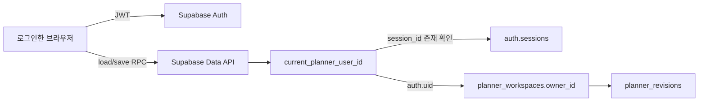

# 과제 7 인증·데이터 소유권 설계

작성일: 2026-09-13  
최종 정리: 2026-09-15  
현재 상태: **인증 UI·소유권/RLS SQL·Turnstile 설정 적용 완료 · Free 플랜 제약으로 계정별 비밀번호 실패 잠금은 사용하지 않음**

이 문서는 과제 6의 공개 단일 작업공간을 과제 7의 사용자별 비공개 작업공간으로 옮기는 기준이다. 실제 비밀번호·토큰·비밀키·이메일·사용자 UUID를 이 문서나 Git에 기록하지 않는다.

2026-09-15 적용 기록: 두 Supabase 마이그레이션을 적용하고, 백업 기준으로 기존 `default` 작업공간을 로그인한 계정의 소유로 이전했다. 확인값은 미소유 작업공간 0개, 현재 revision 212, revision 이력 212개다. 실제 사용자 UUID와 이메일은 기록하지 않는다. Password verification hook은 Free 플랜에서 연결할 수 없어 계정별 실패 잠금은 활성화하지 않는다.

## 이번 단계의 결정

- 인증: Supabase Auth의 이메일·비밀번호 방식.
- 클라이언트: 현재 설치된 `@supabase/supabase-js` 2.116.0.
- 비밀번호 보관: Supabase Auth에 위임한다. Supabase Auth는 무작위 salt를 포함한 bcrypt 해시를 저장하므로 앱 DB와 브라우저 코드가 비밀번호 원문을 보관하지 않는다.
- 세션: 짧은 수명의 JWT access token과 일회성 refresh token을 사용하는 Supabase 세션.
- 소유권: `planner_workspaces.owner_id`가 `auth.users.id`를 참조하며 계정당 작업공간은 한 개다.
- 권한: 로그인한 사용자의 현재 세션과 `owner_id`가 모두 일치해야 한다. 테이블 직접 접근은 회수하고 사용자 범위를 강제하는 RPC만 앱에 공개한다.

직접 비밀번호 해시·세션·메일 인증을 구현하는 방법도 검토했지만 선택하지 않았다. 암호 저장, salt, 토큰 갱신, 이메일 확인을 직접 구현하면 과제의 핵심인 자료 격리보다 오류 가능성과 검증 범위가 커지기 때문이다.

## 데이터 구조와 접근 경로



과제 6의 실제 기록은 계속 JSON 한 덩어리로 보존한다. 작업공간 행을 사용자별로 나누므로 기존 React 상태 구조와 변경 이력 구조를 바꿀 필요가 없다.

| 대상 | 소유권과 접근 규칙 |
| --- | --- |
| `planner_workspaces` | `owner_id = auth.users.id`, 계정당 한 행 |
| `planner_revisions` | 소유한 작업공간의 `workspace_id`를 가진 이력만 접근 |
| `load_planner()` | 유효한 현재 세션의 작업공간만 반환하고 없으면 빈 작업공간 생성 |
| `save_planner(...)` | 호출자의 작업공간만 잠근 뒤 revision 충돌을 검사하고 저장 |
| `load_planner_history(...)` | 호출자의 변경 이력만 최대 500개 반환 |

`supabase/migrations/202609130002_auth_ownership.sql`은 과제 6의 익명 정책을 제거하고, 외래 키 cascade·계정당 한 작업공간 제약·RLS·세 함수의 권한을 설정한다. 사용자나 작업공간 ID를 요청 인자로 받지 않으므로 주소·헤더·본문에 다른 사용자 ID를 넣어도 저장 대상을 바꿀 수 없다.

1단계에서는 SQL 파일과 문서만 정적으로 검토한다. Supabase 프로젝트에는 적용하지 않으며, 적용 성공·접근 거절·자료 이전 완료는 실제 실행 증거가 생기기 전까지 체크리스트에서 완료 처리하지 않는다.

## 로그아웃·비밀번호 변경 뒤 이전 인증값 차단 설계

Supabase의 일반 로그아웃은 refresh token을 폐기하지만 이미 발급된 access token은 만료 시각까지 유효할 수 있다. 그래서 RLS와 RPC가 `auth.uid()`만 확인하지 않고 JWT의 `session_id`가 `auth.sessions`에 현재 존재하는지도 `current_planner_user_id()`에서 확인한다.

이 설계가 적용되면 로그아웃 또는 비밀번호 변경으로 세션이 종료된 뒤 같은 JWT를 다시 보내도 소유자가 확인되지 않아 `authentication_required`로 거절되어야 한다. 이 동작은 SQL 실행 후 실제 요청으로 반드시 검증한다. Supabase 프로젝트 설정이나 로그아웃 범위에 따라 세션 행이 예상대로 즉시 제거되지 않으면 세션 폐기 테이블을 추가하는 방식으로 보완한다.

## 로그인 반복 공격과 전달 헤더 방어

보안 설정의 단일 원본은 `shared/securityConfig.ts`다. 여기에는 향후 유료 플랜용 비밀번호 실패 잠금 설정과 전달 IP 헤더 비신뢰, Cloudflare Turnstile 필수가 함께 있다. Free 플랜에서는 Password verification hook을 연결할 수 없어 실패 잠금 설정은 실행 경로에 연결하지 않는다. CAPTCHA 비밀키는 파일에 넣지 않고 Supabase Dashboard에만 저장하며 브라우저에는 `VITE_TURNSTILE_SITE_KEY` 공개 사이트 키만 둔다.

비밀번호 검증 훅 SQL은 유료 플랜 전환 시 사용할 준비 상태로 남겨 둔다. 이 훅은 Supabase Auth가 제공한 `user_id`만 잠금 키로 쓰며 `X-Forwarded-For`, `Forwarded`, 임의 본문 IP를 읽지 않는다. 현재 인증 요청은 Express를 거치지 않고 Supabase로 직접 전송되며, Free 플랜의 실제 로그인 보호는 Turnstile CAPTCHA와 Supabase 기본 요청 제한이다.

계정 단위 잠금은 공격자가 알고 있는 이메일을 일부러 잠그는 서비스 거부 공격을 만들 수 있다. 현재는 이 기능을 활성화하지 않고 Turnstile과 Supabase Auth의 IP 기반 요청 제한을 함께 사용한다. UI는 존재하지 않는 이메일과 비밀번호 오류를 같은 문구로 표시한다. CAPTCHA는 실제 가입·로그인에서 확인했으며, 유료 플랜 전환 뒤에만 훅 기반 잠금을 검증한다.

## 백업과 전환 순서

**아직 아래 SQL을 실행하지 않는다.** 인증 UI와 새 데이터 호출 코드가 준비되기 전에 마이그레이션을 실행하면 현재 공개 앱은 자료를 불러오지 못한다.

1. 과제 6 최종 커밋과 배포를 고정한다.
2. 현재 앱의 `전체 내보내기`로 JSON 파일을 내려받아 열리는지 확인한다. 파일은 저장소 밖에 보관한다.
3. Supabase SQL Editor에서 아래 백업 조회만 실행하고 결과를 JSON 또는 CSV로 내려받는다.
4. 2단계에서 인증 UI와 사용자별 RPC 호출 코드를 배포한다.
5. 앱에서 소유자 계정을 한 개 만들고 Supabase Dashboard의 Authentication → Users에서 그 계정 UUID를 복사한다.
6. 앱을 닫은 상태에서 `202609130002_auth_ownership.sql`과 생성된 `202609140003_auth_abuse_protection.sql`을 순서대로 실행한다.
7. Supabase Dashboard에서 비밀번호 검증 훅과 Turnstile을 활성화하고 Auth 요청 제한을 확인한다. 비밀키는 Dashboard에만 입력한다.
8. 아래 소유권 이전 SQL의 영 UUID를 복사한 실제 UUID로 바꾸고 즉시 실행한다. 이메일은 SQL에 넣지 않는다.
9. 검증 조회의 `null_owner_count = 0`, 소유자 작업공간 `1`, 기존 revision과 데이터 크기 일치를 확인한 뒤 앱을 연다.

### SQL Editor 백업 조회

결과에는 실제 개인 기록이 포함된다. 내려받은 파일 이름은 `planner-before-auth.private.json`처럼 정하고 Git에 추가하지 않는다.

```sql
select jsonb_pretty(jsonb_build_object(
 'exported_at', now(),
 'workspace', (select to_jsonb(workspace) from public.planner_workspaces workspace where id = 'default'),
 'revisions', coalesce((
  select jsonb_agg(to_jsonb(revision) order by revision.revision)
  from public.planner_revisions revision
  where revision.workspace_id = 'default'
 ), '[]'::jsonb)
)) as private_backup;

select id, revision, updated_at, pg_column_size(data) as data_bytes, md5(data::text) as data_checksum
from public.planner_workspaces
where id = 'default';

select count(*) as revision_count, min(revision) as first_revision, max(revision) as last_revision
from public.planner_revisions
where workspace_id = 'default';
```

### 기존 `default` 자료를 내 계정으로 이전

영 UUID를 그대로 두면 예외가 발생하므로 실수로 다른 계정에 이전되지 않는다. 마이그레이션 실행 뒤 앱을 다시 열기 전에 수행한다.

```sql
begin;

do $$
declare
 target_owner uuid := '00000000-0000-0000-0000-000000000000';
 empty_state jsonb := '{"timezone":"Asia/Seoul","care":[],"logs":[],"projects":[],"stages":[],"tasks":[],"executions":[],"rules":[],"plans":[],"reviews":[]}'::jsonb;
begin
 if target_owner = '00000000-0000-0000-0000-000000000000'::uuid then
  raise exception 'replace_target_owner_uuid';
 end if;
 if not exists (select 1 from auth.users where id = target_owner) then
  raise exception 'target_auth_user_not_found';
 end if;
 if not exists (select 1 from public.planner_workspaces where id = 'default') then
  raise exception 'legacy_default_workspace_not_found';
 end if;

 -- 마이그레이션 뒤 실수로 앱을 먼저 열어 생긴 완전한 빈 작업공간만 제거한다.
 if exists (
  select 1 from public.planner_workspaces workspace
  where workspace.owner_id = target_owner
    and workspace.id <> 'default'
    and (workspace.revision <> 0 or workspace.data <> empty_state)
 ) then
  raise exception 'target_already_has_nonempty_workspace';
 end if;
 delete from public.planner_workspaces
 where owner_id = target_owner and id <> 'default' and revision = 0 and data = empty_state;

 update public.planner_workspaces
 set owner_id = target_owner
 where id = 'default' and owner_id is null;

 if not exists (
  select 1 from public.planner_workspaces
  where id = 'default' and owner_id = target_owner
 ) then
  raise exception 'legacy_workspace_owner_conflict';
 end if;
end $$;

alter table public.planner_workspaces alter column owner_id set not null;
commit;
```

### 이전 직후 검증 조회

UUID와 checksum은 제출 증거에서 일부를 가린다. 데이터 내용 자체를 캡처하지 않는다.

```sql
select count(*) as null_owner_count
from public.planner_workspaces
where owner_id is null;

select id, left(owner_id::text, 8) || '…' as masked_owner, revision,
       pg_column_size(data) as data_bytes, md5(data::text) as data_checksum
from public.planner_workspaces;

select workspace_id, count(*) as revision_count,
       min(revision) as first_revision, max(revision) as last_revision
from public.planner_revisions
group by workspace_id;
```

## 인증 구현 설명서 초안

### ① 무엇으로 붙였나

Supabase Auth 이메일·비밀번호 인증과 `@supabase/supabase-js` 2.116.0을 사용한다. 비밀번호는 Supabase Auth의 bcrypt 저장에 맡기고, 앱은 JWT 기반 세션과 PostgreSQL RLS로 자료 소유권을 확인한다.

### ② 왜 그걸 골랐나

현재 데이터베이스가 이미 Supabase이므로 같은 사용자 ID를 RLS의 `auth.uid()`와 바로 연결할 수 있다. 직접 인증을 만들 때 생기는 비밀번호 저장·토큰 갱신 오류를 줄이고 자료 격리와 검증에 집중할 수 있다.

### ③ 어디를 어떻게 고쳤나

- `src/AuthScreen.tsx`: 로그인·회원가입 전환, 공통 오류, 중복 제출 차단, CAPTCHA 없을 때 요청 차단.
- `src/Turnstile.tsx`: 공식 Turnstile 스크립트를 로드하고 발급 토큰·만료·오류를 관리.
- `src/auth.ts`, `src/supabase.ts`: Supabase Auth 가입·로그인·로그아웃과 지속·자동 갱신 세션.
- `src/App.tsx`: 인증 확인 전 로딩 화면, 미인증 로그인 게이트, 로그인 뒤 자료 로드, 로그아웃 시 메모리 상태 초기화.
- `src/data.ts`: 고정 `default` 테이블 직접 조회를 제거하고 `load_planner`, `save_planner`, `load_planner_history`만 호출.
- `shared/securityConfig.ts`, `scripts/securityMigration.ts`: 보안 설정 단일 원본과 실패 잠금 SQL 생성·불일치 검사.
- `server/index.ts`: Express가 클라이언트 전달 IP 헤더를 신뢰하지 않도록 설정.

### ④ 안 열리는 것을 확인한 기록

아직 SQL을 실행하거나 계정 두 개로 요청하지 않았으므로 비어 있다. 구현 후 성공 요청과 거절 요청을 같은 주소·방식으로 나란히 기록하며 토큰은 앞부분만 남기고 가린다.

### ⑤ AI와 나

- AI에게 맡긴 일: 인증·소유권 구조, 마이그레이션 SQL, 백업·이전·검증 절차 초안 작성.
- 직접 판단한 일: Supabase Auth 사용, 기존 과제 6 자료를 내 계정으로 이전, 작업을 단계별로 나눠 진행.
- AI 제안을 따르지 않은 일: 현재 없음. 이후 실제 화면과 보안 검증 결과를 보고 결정한다.

### ⑥ 아직 못 막은 것

- 가입·로그인 UI와 이메일 확인 뒤 세션 수신 코드는 구현했지만 실제 이메일 발송·확인 흐름은 검증하지 않았다.
- SQL을 실제 프로젝트에 적용하지 않아 익명 접근과 계정 간 격리를 아직 검증하지 않았다.
- 로그인 실패 잠금 SQL과 전달 헤더 비신뢰 설정은 준비했고 Supabase CAPTCHA는 Turnstile 제공자로 활성화했다. 비밀번호 검증 훅·Auth 요청 제한과 실제 Turnstile 인증 요청은 아직 적용하거나 검증하지 않았다.
- MFA, 비밀번호 재설정, 계정 삭제 호출은 아직 구현하지 않았다. 계정 탈취 대응과 사용자 스스로 자료를 지울 권리에 영향을 줄 수 있다.
- 종료된 세션을 `auth.sessions`로 즉시 차단하는 동작은 실제 로그아웃·비밀번호 변경 요청으로 검증해야 한다.

## 다음 단계

3단계의 전체 자료 백업, Turnstile 위젯 생성, 로컬 공개 사이트 키 설정, Supabase CAPTCHA 활성화는 완료했다. 다음으로 공개 사이트 키를 배포 환경에 설정하고 소유자 계정을 준비한 뒤, 별도 확인을 거쳐 두 마이그레이션을 순서대로 실행하고 기존 `default` 자료를 이전한다. 비밀번호 검증 훅과 Auth 요청 제한까지 설정한 뒤 실제 인증 요청으로 보호 동작을 검증한다.

## 참고한 공식 문서

- [Supabase Password security](https://supabase.com/docs/guides/auth/password-security)
- [Supabase User sessions](https://supabase.com/docs/guides/auth/sessions)
- [Supabase Signing out](https://supabase.com/docs/guides/auth/signout)
- [Supabase Row Level Security](https://supabase.com/docs/guides/database/postgres/row-level-security)
- [Supabase Password Verification Hook](https://supabase.com/docs/guides/auth/auth-hooks/password-verification-hook)
- [Supabase CAPTCHA Protection](https://supabase.com/docs/guides/auth/auth-captcha)
